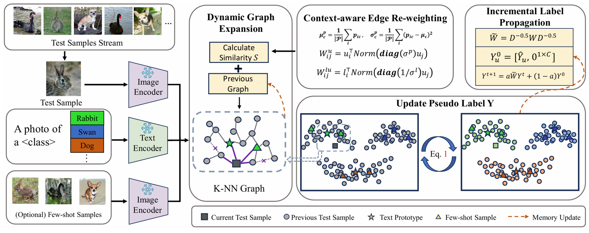

# Efficient and Context-Aware Label Propagation for Zero-/Few-Shot Training-Free Adaptation of Vision-Language Model

This repository provides the official PyTorch implementation of our ICLR 2025 paper:    


> [<ins>**Efficient and Context-Aware Label Propagation for Zero-/Few-Shot Training-Free Adaptation of Vision-Language Model**</ins>]
[](https://arxiv.org/abs/2412.18303)
[](https://openreview.net/forum?id=D10yarGQNk) <br>
> Authors: *[<ins>**Yushu Li***</ins>](https://yushu-li.github.io/), [<ins>**Yongyi Su***</ins>](https://yysu.site/), [<ins>**Adam Goodge**</ins>](https://agoodge.github.io/), [<ins>**Kui Jia**</ins>](http://kuijia.site/), [<ins>**Xun Xu†**</ins>](https://scholar.google.com/citations?user=pi0SGQUAAAAJ)*   


## 🔍 Overview

<p align = "center">

</p>
<p align = "center">
The overall framework of ECALP.
</p>
ECALP offers a training-free approach to adapt vision-language models to new image classification tasks. Its label propagation mechanism provides inductive inference, removing the burden of downstream task hyperparameter searches.<br><br>
This repository contains the code for ECALP, using pre-extracted image and text features from a fixed CLIP model, and showcases its performance across diverse challenges, including fine-grained categorization, style-transfer, and out-of-distribution scenarios:

* Fine-Grained Categorization Tasks
* Style-Transfer Tasks
* Out-of-Distribution Tasks


## 📐 Prerequisites

### Hardware

This implementation supports single-GPU configurations. We recommend an NVIDIA RTX 3090 with 24GB of memory for optimal performance, as used in our experiments.

### Environment 
The code is tested on PyTorch 1.13.1.

### Pre-extracted Features

Image and text features for this implementation are extracted using the DMN repository with fixed CLIP models (ResNet50 and VIT-B/16). See the [DMN](https://github.com/YBZh/DMN) repository for extraction details. 

To simplify setup, we have pre-extracted these features. Download the archive from [Google Drive](https://drive.google.com/drive/folders/10MMCLgnm32XqgS-iPgw0I2Y3y4gzL_47?usp=sharing), organized in the following directory structure:

```
./features/
├── fine_grained/
│   ├── RN/
│   └── VIT/
├── out_of_distribution/
│   ├── RN/
│   └── VIT/
└── style_transfer/
    ├── RN/
    └── VIT/
```

## 🚀 Run ECALP

This section details how to execute ECALP using the provided main.py script.

Usage:

```
python main.py --help
usage: main.py [-h] 
               [--task {fine_grained,style_transfer,out_of_distribution}]
               [--datasets DATASETS] 
               [--clip_model {RN,VIT}] 
               [--mode {ZS,FS}]
               [--num_shots {1, 2, 4, 8, 16}]

Label Propagation with CLIP Features

options:
  -h, --help            show this help message and exit
  --task {fine_grained,style_transfer,out_of_distribution}
                        Task to process
  --datasets DATASETS   Datasets to process (separated by "/")
  --clip_model {RN,VIT}
                        Name of the CLIP model
  --mode {ZS,FS}        Zero-shot (ZS) or Few-shot (FS) mode
  --num_shots NUM_SHOTS
                        Number of few-shot examples per class
```

### Fine-Grained Tasks: 

- Available Datasets:  I/Flower102/DTD/Pets/Cars/UCF101/Caltech101/Food101/SUN397/Aircraft/eurosat

- Example: To run ECALP with CLIP-VIT-B/16 on the DTD dataset in zero-shot mode:
```
python main.py --task fine_grained --datasets DTD --clip_model VIT --mode ZS
```
- Example: To run ECALP with CLIP-RN-50 on the DTD dataset in 16-shot mode:
```
python main.py --task fine_grained --datasets DTD --clip_model RN --mode FS --num_shots 16
```

### Style-Transfer Tasks:
- Available Datasets: A/V/R/K (ImageNet-A, ImageNet-V2, ImageNet-R, ImageNet-Sketch)

- Example: To run ECALP with CLIP-RN-50 on the ImageNet-A dataset in zero-shot mode:
```
python main.py --task style_transfer --datasets A --clip_model RN --mode ZS
```

### Out-of-Distribution Tasks:
- Available Datasets: gaussian_noise/shot_noise/impulse_noise/defocus_blur/glass_blur/motion_blur/zoom_blur/snow/frost/fog/brightness/contrast/elastic_transform/pixelate/jpeg_compression

- Example: to run ECALP with CLIP-VIT-B/16 on the Gaussian Noise dataset in zero-shot mode, use the following command:
```
python main.py --task out_of_distribution --datasets gaussian_noise --clip_model VIT --mode ZS
```

## 📜 Citation
If you find our code useful or our work relevant, please consider citing: 
```BibTeX
@inproceedings{li2025efficient,
  title={Efficient and Context-Aware Label Propagation for Zero-/Few-Shot Training-Free Adaptation of Vision-Language Model},
  author={Yushu Li and Yongyi Su and Adam Goodge and Kui Jia and Xun Xu},
  booktitle={The Thirteenth International Conference on Learning Representations},
  year={2025},
  url={https://openreview.net/forum?id=D10yarGQNk}
}
```

## 🙏 Acknowledgements

We extend our sincere gratitude to the authors of the following repositories for their valuable open-source implementations and data preparation guidance:
- [DMN](https://github.com/YBZh/DMN)
- [ZLaP](https://github.com/YBZh/DMN)
- [TDA](https://github.com/kdiAAA/TDA)
- [CoOp/CoCoOp](https://github.com/KaiyangZhou/CoOp)
- [TPT](https://github.com/azshue/TPT/tree/main)
- [CLIP](https://github.com/openai/CLIP)
